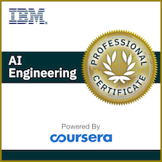
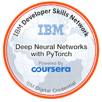
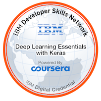
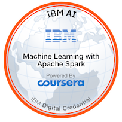
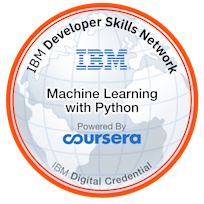

### Hi there 👋

<!-- Tech Stack -->
## 🛠️ Tech Stack

  

 

## </> Selected Projects

- **[CanvasAI](https://canvas-ai2d.vercel.app/)** -  allows you to break free from linear chat threads. Visualize your thoughts, branch conversations, and orchestrate multiple AI models on a single, infinite spatial interface.

- **[Pishkar](https://github.com/zendegani/yaclaw/tree/main)** - Yet-Another-Claw (YAClaw) a crash-resilient, local-first AI butler. Features multi-provider LLMs, Model Context Protocol (MCP) support, and cross-interface chat (Web UI & Telegram).

- **[XClipper](https://chromewebstore.google.com/detail/xclipper/epmmehilhbpkgcjbcohgkmihlalagkho)** - (a.k.a tweet2md) The high-fidelity X / Twitter web clipper — save posts, threads & articles to Markdown, PDF, HTML, JSON, CSV & Obsidian, one at a time or in batch.

  

  
<!-- 

## [Badges](https://www.youracclaim.com/users/zendegani/badges)

-->

<!-- 

 -->

<!-- https://www.youracclaim.com/badges/97ee1352-ca26-45d9-8218-71d1c7092498/public_url -->

<!--   -->

