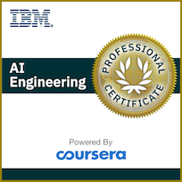

### Hi there 👋

<!--
**zendegani/zendegani** is a ✨ _special_ ✨ repository because its `README.md` (this file) appears on your GitHub profile.

Here are some ideas to get you started:

- 🔭 I’m currently working on ...
- 🌱 I’m currently learning ...
- 👯 I’m looking to collaborate on ...
- 🤔 I’m looking for help with ...
- 💬 Ask me about ...
- 📫 How to reach me: ...
- 😄 Pronouns: ...
- ⚡ Fun fact: ...
-->

## [Badges](https://www.youracclaim.com/users/zendegani/badges)

<!-- 

 -->

<!-- https://www.youracclaim.com/badges/97ee1352-ca26-45d9-8218-71d1c7092498/public_url -->

<!--   -->

